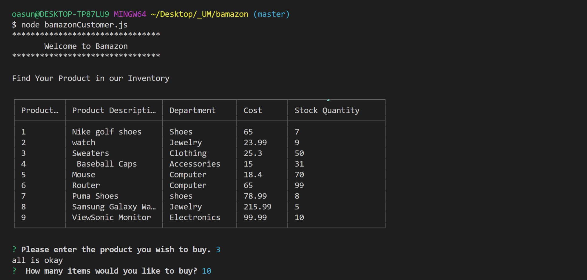
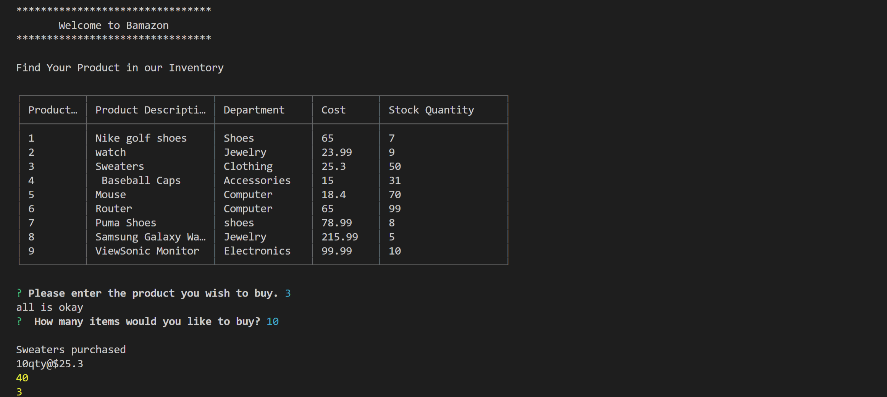
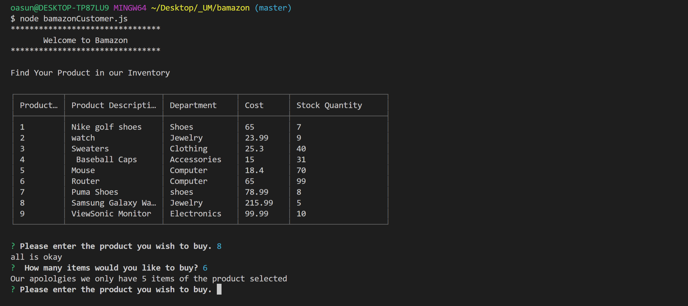

# bamazon

## Overview
 
*The goal of this assignment is to create an Amazon-like storefront using Node.js and MySQL.*

### How the application works.

 *  Create MySQL Database *BamazonDB*
    
    In order to run this application, setup MySQL database on your equipment. Create a Bamazon.sql on your vscode include the following:
        * Database name
        * Table called it "products" with the follwing columns:
            * item_id
            * product_name
            * department_name
            * price (cost to sustumer)
            * stock_quantity
        * Populate Database Table with at least 10 different 
           products.

 *   Create Node application called it "bamazonCustomer.js".

    Running this application will display all items available, including product's id, names and prices.The application will then prompt users with two messages;
    
        1. Please enter the product( item_id) you wish to buy.
        2. How many items you wish to buy?

        
                 
    Once the the user place an order, the app will check if the the store have enough inventory to meet customer's order.

    * If the store _does_ have enough of the items. The application prompt the customer. "Your order has been processed"> It willl also show your items, how many items and cost in dollars.The application will automatically update the stock quantity once the order is successful.

    

    * If the store, has no enough invertory it will prompt the    costumer " Our apologies we only have (quantity of items    selected). This will prevent the costumer from ordering.

    

## Technologies Used

* Node.js
* MySQL
* Inquirer
* cli-Table2

## References
 * YouTube 
 * GitHub Repositories